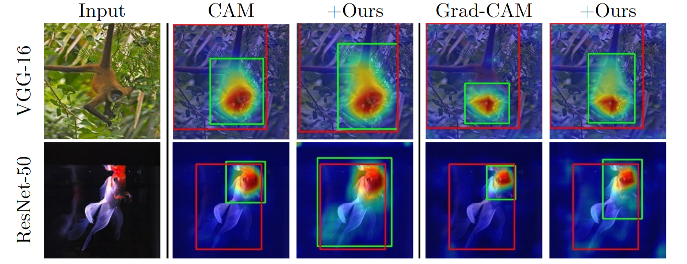
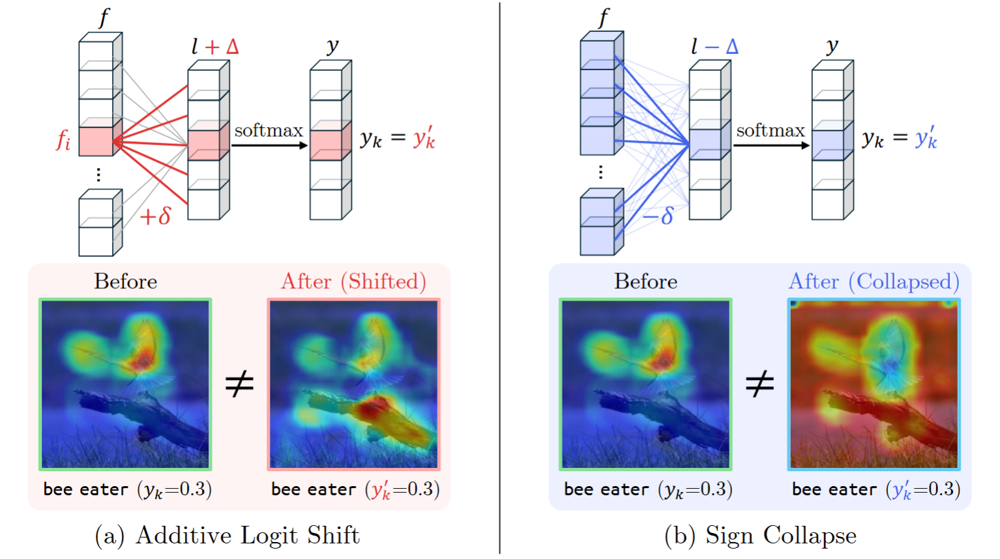
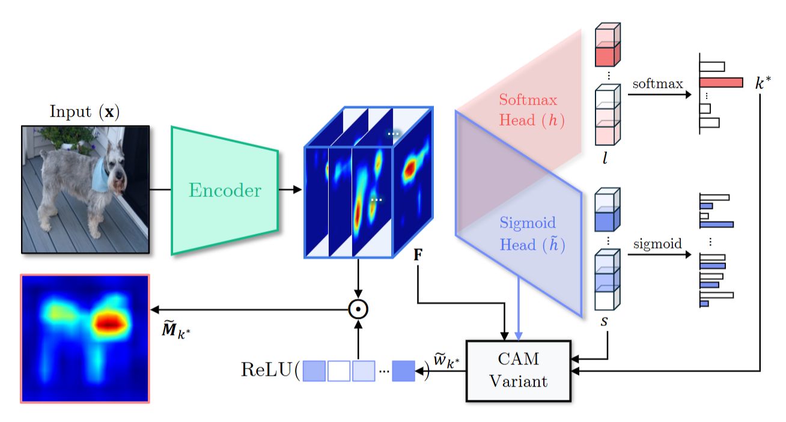
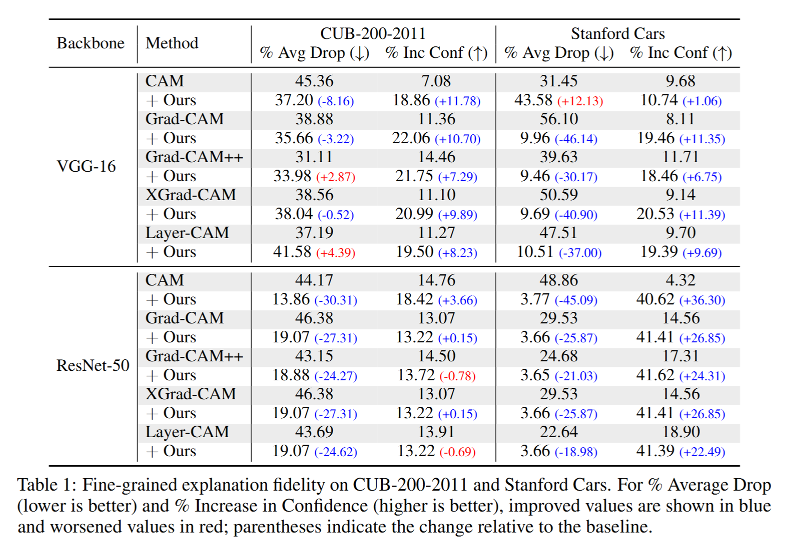
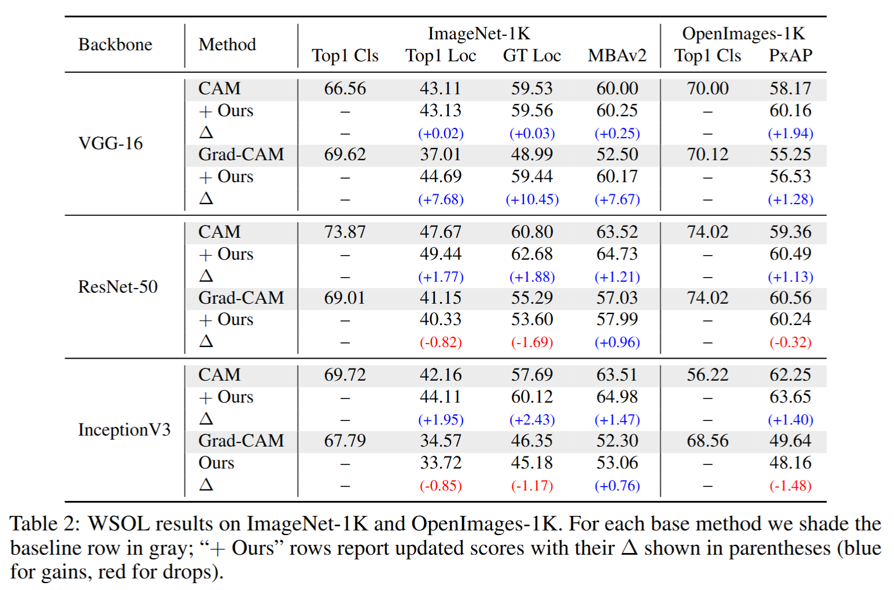

# Dual-CAM: Model-Agnostic Dual-Branch Sigmoid Framework for Precise Class Activation Maps

PyTorch implementation of ''Dual-CAM: Model-Agnostic Dual-Branch Sigmoid Framework for Precise Class Activation Maps''. This repository contains PyTorch training and inference codes with [detailed configurations](https://docs.google.com/spreadsheets/d/1zqAnVeHdSwcrWI22StakPPkaIWpZgxF8/edit?gid=1382508890#gid=1382508890).

## 📋 Table of content
 1. [📎 Paper Link](#1)
 2. [💡 Abstract](#2)
 3. [✨ Motivation](#3)
 4. [📖 Method](#4)
 5. [📃 Requirements](#5)
 6. [✏️ Usage](#6)
    1. [Start](#61)
    2. [Training](#63)
    3. [Inference](#64)
 8. [📊 Experimental Results](#7)

## 📎 Paper Link <a name="1"></a> 
> Dual-CAM: Model-Agnostic Dual-Branch Sigmoid Framework for Precise Class Activation Maps (Living Lab 2025) ([link](https://drive.google.com/file/d/1xBspbElRnbU_TfkJ27H1_BDjXhTLVF7P/view?usp=sharing))
* Authors: Yoojin Oh, Hyewon Joo, Eunhyun Ryu 
* Institution: Ewha Womans University (Dept. of Artificial Intelligence)

<p align="center">
     <br />
    <em> 
    </em>
</p>

## 💡 Abstract <a name="2"></a> 
Class Activation Mapping (CAM) and its extensions have become indispensable tools for visualizing the evidence behind deep network predictions. However, by relying on a final softmax classifier, these methods suffer from two fundamental distortions: **additive logit shifts** that arbitrarily bias importance scores, and **sign collapse** that conflates excitatory and inhibitory features. We propose a simple, architecture-agnostic **dual-branch sigmoid** head that decouples localization from classification. Given any pretrained model, we clone its classification head into a parallel branch ending in per-class sigmoid outputs, freeze the original softmax head, and fine-tune only the sigmoid branch with class-balanced binary supervision. At inference, softmax retains recognition accuracy, while class evidence maps are generated from the sigmoid branch -- preserving both magnitude and sign of feature contributions. Our method integrates seamlessly with most CAM variants and incurs negligible overhead. Extensive evaluations on fine-grained tasks (CUB-200-2011, Stanford Cars) and WSOL benchmarks (ImageNet-1K, OpenImages30K) show improved explanation fidelity and consistent Top-1 Localization gains -- without any drop in classification accuracy.

## ✨ Motivation <a name="3"></a> 

<p align="center">
     <br />
    <em> 
    </em>
</p>

**Motivation.** (A) Additive Logit Shift. Softmax is invariant to adding the same constant across all class logits. While class probabilities stay the same, CAM weights based on l_k (or its gradients) ignore this shift. (B) Sign Collapse. Softmax depends only on the relative differences among logits and ignores their absolute sign, yet it inverts CAM contributions: channels that were positive become inhibitory, thereby misleading the localization.


## 📖 Method <a name="4"></a> 

<p align="center">
     <br />
    <em> 
    </em>
</p>

**The pipeline of the proposed Dual-branch sigmoid CAM.** Inference pipeline of the dual‐branch sigmoid CAM.
After feature extraction, the frozen softmax head predicts the class label $k^*$.
In parallel, any CAM variant computes per‐channel importance scores $\tilde{w}_{k^*}$ (via weights or gradients) for $s_{k^*}$, which are rectified by clamping to positive values.
These positive‐only scores are then linearly combined with the feature maps to produce the final class evidence heatmap $\tilde{M}_{k^*}$.
}
## 📃 Requirements <a name="5"></a> 
  - python 3.12.9 
  - torch 2.5.1
  - torchvision 0.20.1

## ✏️ Usage <a name="6"></a> 

### Start <a name="61"></a> 

```bash  
git clone Dual-CAM
cd Dual-CAM
```

#### Download datasets (ImageNet1K, CUB-200-2011, OpenImages30K, Stanford_Cars) then align with `metadata/&{DATASET_NAME}`.
**NOTE** We build our dual-branch sigmoid head in PyTorch, extending the WSOL evaluation codebase of [wsolevaluation](https://github.com/clovaai/wsolevaluation) and the [pytorch-grad-cam](https://github.com/jacobgil/pytorch-grad-cam) repository. Moreover, training settings for vanilla backbones are almost equivalent with [shared setting](https://docs.google.com/spreadsheets/d/1O4gu69FOOooPoTTtAEmFdfjs2K0EtFneYWQFk8rNqzw/edit?gid=0#gid=0)
### Training <a name="63"></a> 

```bash
python main.py \
  --dataset_name ILSVRC \
  --architecture vgg16 \
  --wsol_method cam \
  --method cam \
  --experiment_name vgg16_cam_ours \
  --wandb_name vgg16_cam_ours \
  --root ${EXPERIMENT_FOLDER/DATASET_NAME} \
  --large_feature_map FALSE \
  --epoch 10 \
  --batch_size 32 \
  --lr_decay_frequency 3 \
  --workers 4 \
  --gpus 1 \
  --lr 0.003 \
  --weight_decay 5.00E-04 \
  --model_structure b2 \
  --ft_ckpt ${CHECKPOINT_PATH} \
  --unfreeze_layer fc2 \
  --project vgg16-0 
```

### Inference <a name="64"></a> 

```bash  
python main.py \
  --dataset_name ILSVRC \
  --architecture vgg16 \
  --wsol_method cam \
  --method cam \
  --experiment_name vgg16_cam_ours \
  --wandb_name vgg16_cam_ours \
  --root ${EXPERIMENT_FOLDER/DATASET_NAME} \
  --large_feature_map FALSE \
  --epoch 10 \
  --batch_size 32 \
  --lr_decay_frequency 3 \
  --workers 4 \
  --gpus 1 \
  --lr 0.003 \
  --weight_decay 5.00E-04 \
  --model_structure b2 \
  --ft_ckpt ${CHECKPOINT_PATH} \
  --unfreeze_layer fc2 \
  --project vgg16-0 \
  --eval_only \
  --eval_checkpoint_type ${PREFIX_OF_CHECKPOINT_FILENAME}
```

## 📊 Experimental Results <a name="7"></a> 
Additional qualitative, quantitative results can be found at Appendix of our paper.
### Task1. Fine-grained explanation fidelity
<p align="center">
     <br />
    <em> 
    </em>
</p>

### Task2. Weakly-Supervised-Object-Localization (WSOL)
<p align="center">
     <br />
    <em> 
    </em>
</p>
-
